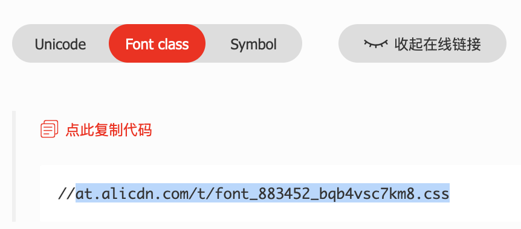

# minapp-iconfont

小程序 iconfont 最佳实践

## 如何使用

1. 通过 `npm` 安装

    ```sh
    npm install minapp-iconfont
    ```

1. 构建

    在开发者工具中点选 `工具` - `构建 npm`

1. 下载 Font-class 的 iconfont.css 并重命名为 iconfont.wxss 置于项目根目录下

    

1. 在 `.json` 文件中引入

    ```json
    {
        "usingComponents": {
            "iconfont": "minapp-iconfont"
        }
    }
    ```

1. 在 `.wxml` 中使用

    ```html
    <iconfont icon="name"></iconfont>
    ```

## 属性

- icon: `String`

    iconfont 中 font class 的类名，不包括 `icon-`。

    如 iconfont 中存在一个 `.icon-name` 的类，使用时只需传递 `name`

    ```html
    <iconfont icon="name"></iconfont>
    ```

## 更新记录

### v0.0.3

#### Chores:

- 添加 keywords

#### Feats:

- 实现功能